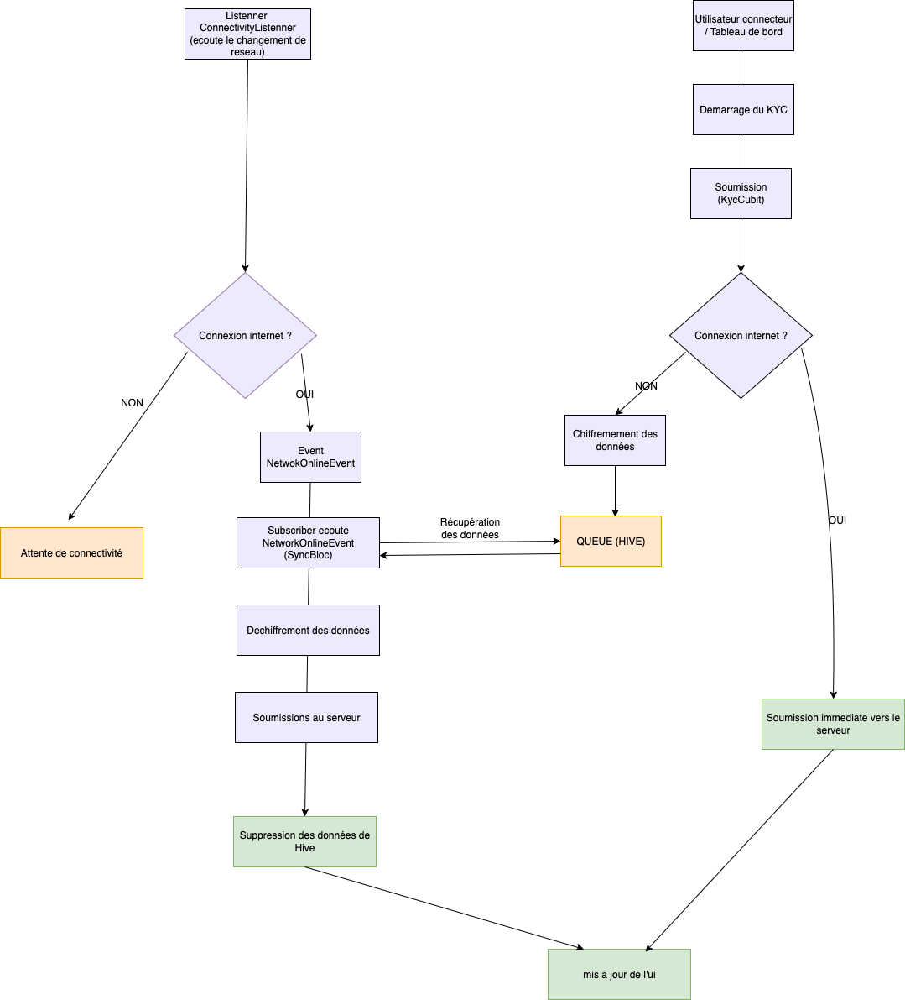

# 📱 KYC Flutter App

**Résumé rapide** : Application Flutter pour la gestion du KYC (avec OCR sur la CNI afin de pré-remplir automatiquement les champs).  
Ce projet suit une architecture **Clean Architecture + BLoC + Event Driven**, avec une **queue** pour gérer automatiquement la synchronisation des données sauvegardées en mode **offline**.
📱 Fonctionnalités implémentées

    OCR CNI : Reconnaissance automatique des données sur les pièces d'identité

    Synchronisation Offline/Online : Gestion transparente de la connexion

    Chiffrement Sécurisé : Protection des données sensibles

    Certificate Pinning : Sécurité renforcée contre les attaques MITM
---
# 🚀 Installation et Exécution

📋 Prérequis
Outils nécessaires

- Flutter SDK 3.24
- Dart 
- Android Studio ou VsCODE
- Un gestionnaire de dépendances :   
Android : Android SDK, Java JDK ≥ 11
iOS : CocoaPods (brew install cocoapods sur macOS)

📂 Cloner le projet
- git clone https://github.com/dgbjkrist/kyc-push-test
- cd kyc-push-test   


📂 Installer les dépendances
- flutter pub get

📂 Créer le fichier de configuration pour le PIN du certificat
- renomer assets/config/config-template.json en assets/config/config.json ou
- cp assets/config/config-template.json assets/config/config.json
Ajouter les valeurs des PIN du certificat du serveur
- Générer le PIN du certificat SSL en remplaçant votredomaine.com par le lien de l'api    
```openssl s_client -connect votredomaine.com:443 -servername votredomaine.com < /dev/null | openssl x509 -pubkey -noout | openssl pkey -pubin -outform der | openssl dgst -sha256 -binary | openssl enc -base64```

▶️ Lancer l’application Sur un émulateur ou device physique
- flutter run

---

# 🏗️ Architecture choisie

- **Presentation** : Cubit / BLoC, Widgets Flutter  
- **Application / Domain** : UseCases, Repositories (abstractions)  
- **Data / Infrastructure** : Implémentations des Repositories, LocalDataSource (Hive), RemoteDataSource (API clients)  
- **DI** : GetIt (composition root)  

---

# 🔒 Sécurité de l'application

Ce projet intègre plusieurs mécanismes de sécurité pour protéger les données sensibles des utilisateurs, aussi bien en **réseau** qu’en **stockage local**.  
Ces mesures s’inspirent des bonnes pratiques et standards de l’industrie : **OWASP Mobile Security**, **PCI DSS**.

## 🌐 Réseau
- Validation stricte des certificats.  
- Utilisation de **tokens d’authentification** dans les headers.  
- Support du **certificate pinning** pour prévenir les attaques *Man-in-the-Middle (MiTM)*.   

## 💾 Stockage local
- Les documents KYC (photos recto/verso, selfie) sont **chiffrés** avant d’être stockés localement.  
- Algorithme utilisé : **AES-256** via `SecureFileStorage`.  
- La base Hive (ou SQLite) ne contient que des **métadonnées** (ex : chemin vers le fichier chiffré), et elle est également chiffrée.  
- Suppression sécurisée des fichiers et des entrées Hive après la soumission réussie du KYC.  


## 🔑 Gestion des clés
- Les clés de chiffrement sont générées dynamiquement et stockées dans **`flutter_secure_storage`** (Keychain iOS / Keystore Android).  
- Aucun secret sensible n’est codé en dur.

## 🔑  Librairies notables

- UI: flutter_bloc / cubit, Imapicker, OCR, google_mlkit_text_recognition (Pour extraire les informations des documents d'identité des utilisateurs [FEATURE UTILE])
- Storage: hive, hive_flutter, flutter_secure_storage, encrypt (SAUVEGARDE DES TOKEN) POUR LES RESPECT DES PRINCIPES OWASP
- Network: Dio pour les requetes HTTPS, ASN1Parser/Encrypt pour extraire les SPKI et comparer au PIN du certificat
- Utilities: connectivity_plus pour gerer le mode ON/OFF LINE.

---

# 🔄 Flow Offline / Online (avec BLoC et ConnectivityListener)

